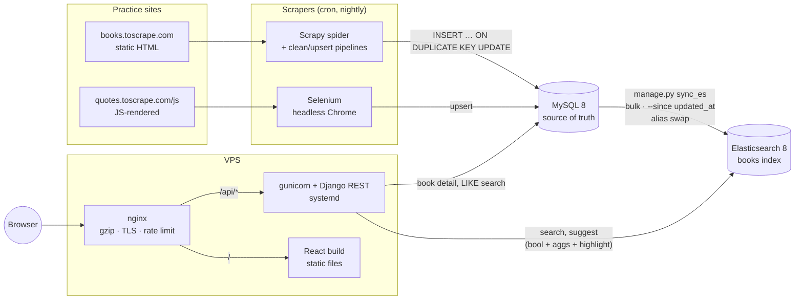

# ScrapeSearch

Full-text search over scraped data: **Scrapy + Selenium → MySQL → Elasticsearch → Django REST API → React**,
deployed on a Linux VPS behind nginx, with systemd, cron and bash scripts.

It scrapes 1,000 books from [books.toscrape.com](https://books.toscrape.com) and 100 quotes from the
JavaScript-rendered [quotes.toscrape.com/js](https://quotes.toscrape.com/js/) (both are sandboxes built for
scraping practice), stores them in MySQL, and serves typo-tolerant, faceted search from Elasticsearch.

**Live demo:** _coming soon_ (deployment guide: [deploy/RUNBOOK.md](deploy/RUNBOOK.md))

- Typo-tolerant search: `harry poter` finds Harry Potter. MySQL `LIKE` finds nothing.
- Autocomplete as you type (`search_as_you_type`, debounced, keyboard navigable)
- Category, rating and price facets whose counts update with every other filter
- Highlighted matches, pagination, shareable URLs, light and dark themes, works on phones
- A MySQL `LIKE` endpoint next to it, so the difference is measurable (see [ES vs LIKE](#elasticsearch-vs-mysql-like))

---

## Architecture



**Why two stores?** MySQL is the source of truth: transactions, constraints, dedupe on `url`. Elasticsearch is
a *derived* read model, optimized for relevance-ranked full-text search and facets. It can be rebuilt from MySQL
at any time (`sync_es`), so losing it loses nothing. The book detail page reads MySQL, because ES can lag by up
to one sync.

## Tech stack

| Layer | Tools |
|---|---|
| Scraping | Scrapy 2.19 (AutoThrottle, robots.txt, item pipelines), Selenium 4 + headless Chrome (explicit waits) |
| Storage | MySQL 8 (`utf8mb4`, UTC, Django migrations own the schema) |
| Search | Elasticsearch 8.19, official `elasticsearch` Python client, raw query DSL (no ORM wrapper) |
| API | Django 5.2 LTS + Django REST Framework, gunicorn |
| Frontend | React 19 + Vite 8, plain CSS |
| Ops | Docker Compose (local), Ubuntu + nginx + systemd + cron + bash (production), pytest |

## Repository layout

```
├── docker-compose.yml      MySQL, Elasticsearch, Kibana, Django API, Vite dev server
├── scraper/
│   ├── scrapesearch/       Scrapy project: spider, items, cleaning, pipelines, db helpers
│   ├── quotes_selenium.py  Selenium scraper for the JS-rendered site
│   └── tests/
├── backend/
│   ├── catalog/            MySQL models (Book, Quote), migrations, book detail + LIKE search
│   ├── search/             ES client, mapping, query builders, search/suggest views, sync_es command
│   └── tests/
├── frontend/src/           React app: SearchBox, Facets, ResultList, Pagination, BookDialog
├── scripts/compare_search.py   ES vs LIKE benchmark (the numbers below)
└── deploy/                 nginx.conf, gunicorn.service, scraper.cron, scripts/*.sh, RUNBOOK.md
```

## Run it locally

Needs Docker, Python 3.12+ and Google Chrome (for the Selenium scraper).

```bash
cp .env.example .env
```
Then set the passwords and a `DJANGO_SECRET_KEY` in `.env`. Generate a key with
`python -c "import secrets; print(secrets.token_urlsafe(50))"`.

```bash
docker compose up -d
```
Starts MySQL, Elasticsearch, Kibana, the Django API (which runs migrations on start) and the React dev server.

```bash
python -m venv .venv && .venv/bin/pip install -r scraper/requirements.txt
```
The scrapers run on your machine. (On Windows: `.venv\Scripts\pip`.)

```bash
cd scraper && ../.venv/bin/scrapy crawl books && ../.venv/bin/python quotes_selenium.py && cd ..
```
Scrapes 1,000 books (about 12 minutes, deliberately polite) and 100 quotes into MySQL.

```bash
docker compose exec api python manage.py sync_es
```
Builds the Elasticsearch index from MySQL.

Open **http://localhost:5173**. Kibana is at http://localhost:5601 (Dev Tools, for trying ES queries by hand).

<details>
<summary>Running Django and Vite on the host instead (faster reloads, debugger)</summary>

```bash
docker compose up -d mysql elasticsearch kibana
```

```bash
.venv/bin/pip install -r requirements-dev.txt
```

```bash
.venv/bin/python backend/manage.py migrate && .venv/bin/python backend/manage.py runserver
```

```bash
cd frontend && npm install && npm run dev
```
</details>

### Tests

```bash
.venv/bin/pip install -r requirements-dev.txt && .venv/bin/pytest
```
75 tests, about 12 seconds. They cover the scraper's cleaning functions, spider selectors (against small
hand-written HTML pages) and pipelines, the ES query builders, the API (with a fake ES client), the MySQL
endpoints, and `sync_es` against a real, throwaway ES index. Tests that need ES skip themselves when it isn't running.

## API

| Endpoint | Backed by | Example |
|---|---|---|
| `GET /api/search` | Elasticsearch | `?q=harry poter&category=Fantasy&min_rating=4&min_price=10&max_price=30&page=1` |
| `GET /api/suggest` | Elasticsearch | `?q=harry pot`: up to 8 `{id, title}` |
| `GET /api/books/<id>` | MySQL | `/api/books/1` |
| `GET /api/search-sql` | MySQL `LIKE` | `?q=poter`: for comparison, includes the SQL it ran |
| `GET /api/health` | Django | `{"status": "ok"}` for health checks |

Invalid parameters return `400` with a per-field message. If Elasticsearch is down, search returns `503`
("temporarily unavailable") instead of a stack trace.

## A sample Elasticsearch query, explained

This is what `GET /api/search?q=harry poter&category=Fantasy&min_rating=4` sends to ES, trimmed a little
(built in [backend/search/queries.py](backend/search/queries.py)):

```jsonc
GET books/_search
{
  "query": {
    "bool": {
      "must": [{                                   // (1) decides WHAT matches, and scores it
        "multi_match": {
          "query": "harry poter",
          "fields": ["title^3", "description"],    // a title match counts 3x
          "fuzziness": "AUTO",                     // "poter" -> "potter" (1 edit)
          "prefix_length": 1,
          "minimum_should_match": "2<75%"          // 2 words: both required
        }
      }],
      "should": [{                                 // (2) exact-match bonus, only re-ranks
        "multi_match": { "query": "harry poter", "fields": ["title^3", "description"], "boost": 2 }
      }],
      "filter": []                                 // (3) price range goes here: yes/no, cached
    }
  },
  "post_filter": { "bool": { "filter": [           // (4) facet selections: applied to hits only
    { "term":  { "category": "Fantasy" } },
    { "range": { "rating": { "gte": 4 } } }
  ]}},
  "aggs": {                                        // (5) facet counts, over ALL matches
    "categories": { "filter": { "range": { "rating": { "gte": 4 } } },
                    "aggs": { "values": { "terms": { "field": "category", "size": 50 } } } },
    "ratings":    { "filter": { "term": { "category": "Fantasy" } },
                    "aggs": { "values": { "histogram": { "field": "rating", "interval": 1 } } } }
  },
  "highlight": { "encoder": "html",                // (6) escape the text, then add <mark>
                 "fields": { "title": { "number_of_fragments": 0 }, "description": {} } },
  "from": 0, "size": 20                            // (7) page 1
}
```

1. **`must` + `multi_match`**: the text is analyzed with the `english` analyzer (lowercase, stop words
   removed, stemmed: "running" → "run"), matched against the inverted index, and scored with **BM25**:
   rare terms, repeated terms and short fields score higher. `fuzziness: AUTO` allows 1–2 typos depending
   on word length.
2. **`should`** clauses don't change *which* documents match when there's a `must`, they only add score.
   Without this bonus, "mystery" ranked **Misery** (a 2-edit fuzzy match with a short title) above
   **The Mysterious Affair at Styles** (an exact stemmed match). The benchmark below caught it.
3. **`filter`** clauses are yes/no with no scoring, and ES caches them as bitsets. Anything the user
   *narrows by* goes here; anything they *search for* goes in `must`.
4. **`post_filter`** instead of `filter` for facets: aggregations are computed before `post_filter`
   runs, so picking "Fantasy" doesn't shrink the category facet to one bucket. You can still see (and
   switch to) every other category.
5. **Aggregations**: `terms` gives category counts and `histogram` gives rating counts. Each is wrapped in a
   `filter` agg applying the *other* facet's selection, so the counts stay consistent.
6. **Highlighting** with `encoder: html`: ES HTML-escapes the original text and only adds `<mark>` tags.
   Without it, a scraped title containing `<script>` would reach the page raw (XSS), because the frontend
   renders highlights as HTML.
7. **`from`/`size`** pagination is capped at 50 pages. Deeper paging costs more on every page (each
   shard sorts `from + size` hits, and ES refuses past 10,000). Infinite scroll would use `search_after`
   plus a point-in-time instead.

The `books` index has an **explicit mapping** (`"dynamic": "strict"`): `text` + `english` analyzer for title
and description, a `title.keyword` subfield for exact match and sorting, a `title.suggest`
(`search_as_you_type`) subfield for autocomplete, `keyword` for category, `scaled_float` for price and
`integer` for rating. `books` is an **alias**: a full reindex builds `books_<timestamp>`, then swaps the alias
atomically, so searches never see a half-built index.

## Elasticsearch vs MySQL `LIKE`

Measured with [scripts/compare_search.py](scripts/compare_search.py): the same queries, each the median of 15
runs after a warm-up, timed from Python for both engines. Single-node ES (512 MB heap) and MySQL 8 in Docker
on a laptop. `LIKE` = `WHERE title LIKE '%q%' OR description LIKE '%q%'`, count + first 20 rows (what
`/api/search-sql` does).

### Relevance (1,000 books)

| Query | `LIKE` hits | `LIKE` top 3 (no ranking: id order) | ES hits | ES top 3 (BM25) |
|---|---:|---|---:|---|
| `harry poter` | **0** | (none) | 11 | Harry Potter and the Chamber of Secrets<br>Harry Potter and the Order of the Phoenix<br>Harry Potter and the Prisoner of Azkaban |
| `mystery` | 55 | Shoe Dog: A Memoir by the Creator of NIKE<br>In Her Wake<br>Walk the Edge | 187 | The Emerald Mystery<br>The Mysterious Affair at Styles<br>Becoming Wise: An Inquiry into the Mystery… |
| `running` | 26 | The E-Myth Revisited<br>A Fierce and Subtle Poison<br>Lust & Wonder | 118 | If I Run<br>Running with Scissors<br>Run, Spot, Run |
| `art` | **569** | The Long Shadow of Small Ghosts<br>Amid the Chaos<br>The Art and Science of Low Carb… | 147 | The Art of Not Breathing<br>The Art Forger<br>The Art Book |
| `poetry` | 17 | Twenty Love Poems and a Song of Despair<br>The Collected Poems of W.B. Yeats<br>Leave This Song Behind: Teen Poetry… | 81 | Leave This Song Behind: Teen Poetry…<br>Quarter Life Poetry<br>You can't bury them all: Poems |
| `the great` | 65 | The Rise of Theodore Roosevelt<br>Louisa<br>The Travelers | 106 | The Great Gatsby<br>Kitchens of the Great Midwest<br>The Great Railway Bazaar |

- **Typos:** `LIKE` has no notion of "close enough". One missing letter means zero results.
- **Substrings aren't words:** `art` matches h**eart**, **st**art, p**art**y: 569 hits, most irrelevant. ES matches the *word* "art".
- **Stemming:** `running` also finds "Run" and "Running with Scissors". `LIKE '%running%'` can't.
- **Ranking:** `LIKE` returns rows in table order, so a passing mention in a description ranks the same as the title. BM25 puts "The Great Gatsby" first for `the great`.
- **Precision can still go too far:** ES's fuzzy `mystery` also matches "misery". The fix is scoring (the
  exact-match bonus above), not removing typo tolerance.

### Latency

| Query | `LIKE`, 1k rows | ES, 1k docs | `LIKE`, 100k rows | ES, 100k docs |
|---|---:|---:|---:|---:|
| `harry poter` | 43.9 ms | 8.0 ms | **4,301 ms** | **8.0 ms** |
| `mystery` | 29.7 ms | 10.4 ms | 1,964 ms | 13.9 ms |
| `running` | 38.2 ms | 6.5 ms | 2,158 ms | 9.1 ms |
| `art` | 17.4 ms | 7.2 ms | 1,517 ms | 8.3 ms |
| `poetry` | 40.5 ms | 9.5 ms | 1,920 ms | 10.5 ms |
| `the great` | 36.1 ms | 7.1 ms | 2,272 ms | 7.8 ms |

(100k = every book copied 100 times: `compare_search.py --scale 100`.)

- **`LIKE '%x%'` is a full table scan.** A B-tree index can't help with a leading wildcard, so the cost grows
  linearly with rows: 100× the data made it 47–98× slower. **ES barely moved** (8 → 8 ms), because it looks
  terms up in an inverted index: the cost depends on how many documents *match*, not how many exist.
- **The slowest `LIKE` query is the one with no matches** (`harry poter`, 4.3 s): nothing lets `LIMIT 20`
  stop early, so every row's title *and* description gets scanned.
- At 1,000 rows both are "fast enough" for a human. The honest conclusion is that ES wins on **relevance at
  any size**, and on **latency once the data grows**. MySQL's `FULLTEXT` index would be the middle ground:
  word-based and indexed, but with basic ranking, no fuzziness and no facets.

## Deployment

Production runs on an Ubuntu VPS: **nginx** (static React build, `/api` reverse proxy, gzip, rate limiting,
HTTPS via certbot) → **gunicorn** under **systemd** (`Restart=on-failure`) → Django, with MySQL and
Elasticsearch bound to localhost behind a `ufw` firewall that only allows 22, 80 and 443.
**cron** runs the scrapers nightly, then `sync_es --since 26h`, a weekly full reindex, a nightly MySQL backup
and a 5-minute health check.

The full step-by-step guide, including a break-it-and-fix-it debugging drill, is in
[deploy/RUNBOOK.md](deploy/RUNBOOK.md).

| Script | Purpose |
|---|---|
| [deploy.sh](deploy/scripts/deploy.sh) | pull → pip → migrate → collectstatic → build frontend → reload gunicorn → health check |
| [backup_mysql.sh](deploy/scripts/backup_mysql.sh) | consistent `mysqldump` → gzip → verify → keep 7 days |
| [check_logs.sh](deploy/scripts/check_logs.sh) | ERROR count over the last N hours from journald + scraper logs |
| [healthcheck.sh](deploy/scripts/healthcheck.sh) | API up, ES not red, `books` index not empty; non-zero exit on failure |

## Design decisions and tradeoffs

- **Scrapers write raw SQL, not through the Django ORM.** They stay fast and don't depend on Django. The cost:
  ORM hooks like `auto_now` don't fire, so the `updated_at … ON UPDATE CURRENT_TIMESTAMP` behaviour lives in
  the database (migration `0002`). MySQL skips no-op updates, so re-scraping an unchanged book doesn't
  trigger a re-index.
- **Sync by `updated_at`, not signals or CDC.** Simple and batch-friendly. It **can't see deletes**, so a
  weekly full reindex (atomic alias swap) cleans those up. Signals would miss the raw-SQL writes, and CDC
  (Debezium → Kafka) would be the next step at scale.
- **Blocking MySQL writes in the Scrapy pipeline.** Fine for 1,000 items. At scale: batch with `executemany`.
- **`post_filter` facets** keep every option visible, but can't skip documents early the way a query
  filter can. So they're used for facets only.
- **ES security:** off locally (Docker, localhost only), **on** in production (TLS + password, the ES 8 default).

## What I learned

<!-- Rewrite these in your own words: in an interview you'll be asked about them. -->

- **Explicit waits beat sleeps.** `WebDriverWait` returns the moment the element appears. After clicking
  "Next" you also have to wait for the *old* page to go stale, or you scrape page 1 twice.
- **Mappings are forever.** A field's type can't change after indexing, so plan the mapping up front and
  use an alias so a reindex is a zero-downtime swap.
- **Analyzers are why search "feels smart",** and also why "Paris" is indexed as `pari`. `_analyze` shows exactly what gets stored.
- **Relevance is tuning, not magic.** OR vs AND gave 219 vs 11 results for the same query, and a fuzzy
  match outranked an exact one until I added a `should` bonus. Measuring (the benchmark) is what exposed it.
- **Tests find the bugs I didn't think of:** ES refuses wildcard deletes, a leftover test index made
  another test pass for the wrong reason, and second-precision index names could collide.
- **Production has its own traps:** nginx drops inherited headers when a `location` adds any, cron has no
  `PATH`, `set -e` + `grep` with no matches exits the script, and Windows line endings break bash.
- **A display bug isn't a data bug.** `We�ve` in the terminal was correct UTF-8 in the database. Check
  the bytes before "fixing" the data.
